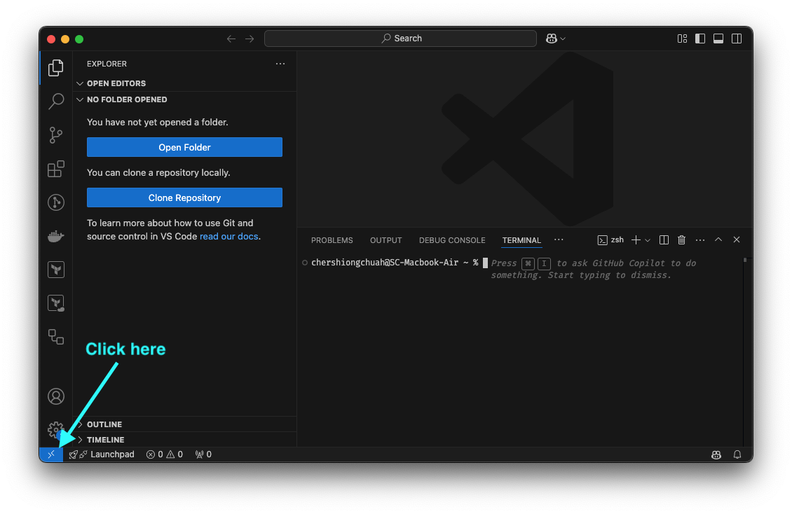

# Secure Shell (SSH)

Secure Shell (SSH) is a protocol that allows you to securely connect to a remote server over an unsecured network. It provides a safe way to access your server's shell (command line) from anywhere in the world. This guide will walk you through the basics of SSH and how to connect to a remote server.

## What You’ll Need

- SSH client on your local machine (e.g., OpenSSH).
- SSH key pair.
- Remote server with SSH enabled.

## Step 1: Install an SSH Client

Most operating systems come with an SSH client pre-installed. Here’s how to check and install SSH on different systems:

=== "MacOS/Linux"
    Open a terminal and type `ssh -V` to check if OpenSSH is installed. If not, you can install it using your package manager (`sudo apt-get install openssh-client` for Ubuntu/Debian or `brew install openssh` for macOS with Homebrew).
=== "Windows"
    Use PuTTY. <https://www.putty.org/>

## Step 2: Generate SSH Keys

SSH keys use public-private cryptography to create a 'key pair' that allows secure communication between your local machine and the server. Here’s how to generate SSH keys:

1. Open your terminal. (Suggestion: navigate to ~/.ssh folder, create it if it doesn't exist)

    ```bash
    cd ~/.ssh
    ```

2. Run the following command to generate a key pair

    ```bash
    ssh-keygen
    ```

3. Follow the prompts to save the key pair. I tend to leave the passphrase empty. By default, the file will be named `id_rsa` and `id_rsa.pub` in the ~/.ssh directory. I would suggest you rename your keys so you are able to identify which key is for which server. For example, if you named the key `test_server_key` This will generate two files: `test_server_key` (private key) and `test_server_key.pub` (public key).

4. View the public key by running:

    ```bash
    cat ~/.ssh/test_server_key.pub
    ```

When setting up your server on DigitalOcean/AWS/Azure, you can paste the contents of the public key into the server's SSH key settings. Now you are ready to connect with your remote server using your private key file.

!!! warning
    **Never share your private key with anyone.** Keep it secure and never expose it to the public. These files are your digital keys to the kingdom.

## Step 3: Set Up Your Server and Obtain Server Information

To connect to your remote server, you’ll need:

- Server IP Address or Domain Name: This is the address of your server that you have provisioned. You can use the domain name once you have set up DNS records.
- Username: The user account on the remote server you’ll be accessing. For example DigitalOcean defaults to `root` and AWS defaults to `ubuntu` or `ec2-user`.
- SSH Key: When creating your server, you should provide the public key as part of the setup process.

## Step 4: Connecting to the Remote Server

Open your terminal. In MacOS, click the top menu `Shell` > `New Remote Connection`

Type `ssh username@server_ip -i ~/.ssh/test_server_key` and press Enter. Replace `username` with your server username, `server_ip` with your server's IP address.

For example: `ssh root@238.38.34.19 -i ~/.ssh/test_server_key`

## How to Copy Files to and from the Server

### Technique 1: SCP (Secure Copy)

You can use the `scp` command to copy files to and from the server. Here are some examples:

Copying files to a server: `scp -i <identity_file> file.txt username@server_ip:/remote/directory`

Copying files from a server: `scp -i <identity_file> username@server_ip:/remote/file.txt /local/directory`

### Technique 2: SFTP (Secure File Transfer Protocol)

Use a `sftp` client - such as FileZilla - to connect with the server using your ssh keys and transfer files.

## Using VSCode to Connect to a Remote Server

Visual Studio Code (VSCode) enables you to connect directly to a remote server from within the editor. This allows you to utilize a remote server as your computing environment right from your local machine. You can provision a powerful temporary server to execute your code and shut it down when finished. With this setup, you can transfer your files to the server, run your code, and then retrieve the results back to your local system.



1. Click the blue connect button in the bottom left
2. Click `Remote-SSH: Connect to Host`
3. Enter `ssh username@server_ip -i ~/.ssh/test_server_key`
4. Click `Connect`

## Troubleshooting

If you encounter issues connecting to your server, consider the following:

- Check your network connection: Ensure you have internet access.
- Verify server credentials: Make sure the IP address, username, and password or SSH keys are correct.
- Firewall settings: Ensure that your server's firewall allows SSH connections (port 22 by default).
- SSH service status: Confirm that the SSH service is running on the server (sudo service ssh status on Linux).

## Conclusion

SSH is an essential tool for securely connecting to remote servers. Using this technique, you now have the capability to spin up powerful virtual computers in the cloud and are no longer constrained by your computer's limitations.
