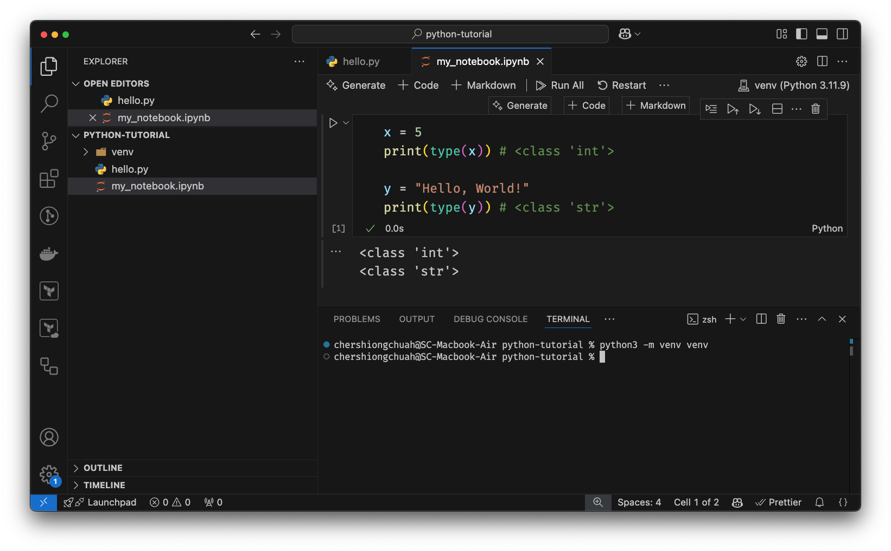

# Data Types

Python has the following data types built-in by default, in these categories:

- Text Type: `str`
- Numeric Types: `int`, `float`, `complex`
- Sequence Types: `list`, `tuple`, `range`
- Mapping Type: `dict`
- Set Types: `set`, `frozenset`
- Boolean Type: `bool`
- Binary Types: `bytes`, `bytearray`, `memoryview`
- None Type: `NoneType`

You can get the data type of any object by using the `type()` function:

```python
x = 5
print(type(x)) # <class 'int'>

y = "Hello, World!"
print(type(y)) # <class 'str'>
```

You can copy the code here and run it within the code cell of a Jupyter notebook.



## Setting the Data Type

Python is a dynamically typed language, also known as duck typing (if it looks like a duck, walks like a duck, then it is a duck). This means that you do not have to declare the data type of a variable when you create one. This is in contrast to statically typed languages like C, C++, Java, etc., where you have to declare the data type of a variable when you create one.

In Python, the data type is set when you assign a value to a variable:

```python
x = "Hello, World!" # str
x = 20 # int
x = 20.5 # float


# List
x = ["apple", "banana", "cherry"]

# Tuple
x = ("apple", "banana", "cherry")

# Range
x = range(6)

# Dictionary
x = {"name" : "John", "age" : 36}

# Set
x = {"apple", "banana", "cherry"}

# Frozen set
x = frozenset({"apple", "banana", "cherry"})

# Boolean
x = True
x = False

# Bytes
x = b"Hello"

```

## Lists

A list is a collection that is ordered and changeable. In Python, lists are written with square brackets. Python uses 0-based indexing, meaning the first element in the list is at index 0, this is in contrast to R, which uses 1-based indexing, so the first element of a list in R is at index 1. Demo below:

```python
example_list = ["apple", "banana", "cherry"]
print(example_list[0]) # apple
print(example_list[1]) # banana
print(example_list[2]) # cherry
```

## Tuples vs Lists

Tuples and lists look similar but have one key difference: Tuples are immutable, meaning you cannot change, add, or remove elements after the tuple is created. Tuples are written with parentheses, and lists are written with square brackets. For example:

```python
example_tuple = ("apple", "banana", "cherry")
example_list = ["apple", "banana", "cherry"]

example_list[0] = "kiwi" # ["kiwi", "banana", "cherry"]
example_tuple[0] = "kiwi" # TypeError: 'tuple' object does not support item assignment
```

## Sets vs Lists

Sets are unordered and unindexed, meaning you cannot access items in a set by referring to an index. Sets are written with curly brackets. You get (amortised) constant time checks for membership. Lists on the other hand require scanning the entire list to check for membership. For example:

```python
example_set = {"apple", "banana", "cherry"}
example_list = ["apple", "banana", "cherry"]

print("banana" in example_set) # This is O(1) ie. much faster.
print("banana" in example_list) # This is O(n)
```

Sets are useful when checking for overlaps between two lists - especially with large datasets.

## Dictionaries

Dictionaries are collections that are unordered, changeable, and indexed. In Python, dictionaries are written with curly brackets, and they have keys and values. For example:

```python
example_dict = {
  "brand": "Ford",
  "model": "Mustang",
  "year": 1964
}
print(example_dict["brand"]) # Ford
```

## What You Really Need to Know

That was a quick tour of the data types in Python. These are the core Python data types that you will commonly use:

1. `int` - Integer
2. `float` - Floating Point Number
3. `str` - String
4. `list` - List
5. `dict` - Dictionary
6. `bool` - Boolean

Just as a final note, there are other data types that you will encounter when you start doing data science - for example: `pandas.DataFrame`, `pandas.Series` and `datetime.datetime` objects - but this is where you should start.

**Finally, remember Python uses 0-based indexing and R uses 1-based indexing.**
