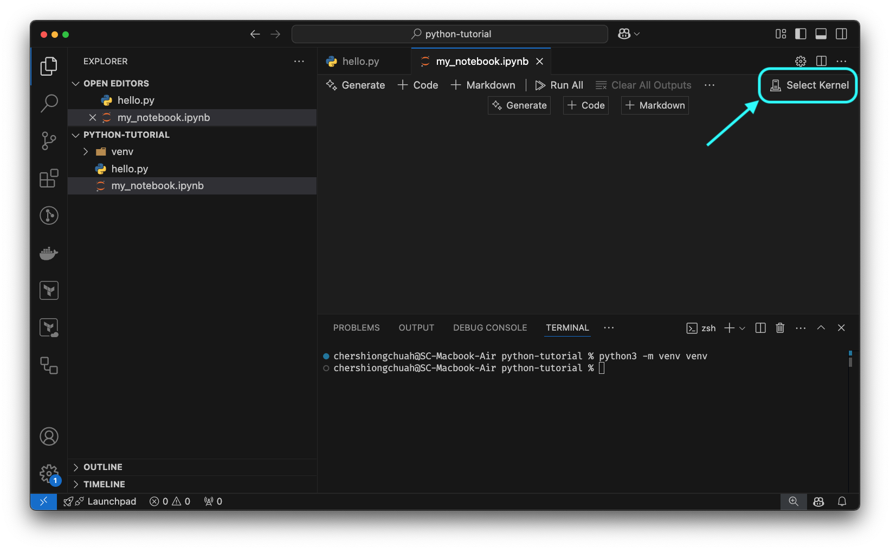

# Jupyter Notebooks

Before we proceed any further, we will begin using Jupyter Notebooks here which allows you to write and run Python code in an interactive environment. This is a great tool for learning Python and data science.

Here's how we get one up and runnning:

!!! note
    We continue in our `python-tutorial` directory or whichever directory you have been using.

## 1. Set up a virtual environment

```bash
python3 -m venv venv
```

## 2. Create a Jupyter Notebook

In VSCode, to create a jupyter notebook, simply create a new file ending with `.ipynb`. For example, `my_notebook.ipynb`.

## 3. Open the Jupyter Notebook in VSCode

## 4. Select the Python Interpreter

Click `Select Kernel` then `Python Environments...` then `venv` with the path showing `venv/bin/python`.



This is how you set which Python interpreter to use for the notebook.

## 5. You're all set
